# Java Concurrency Core - набор примеров многопоточности

## Общая идея

Репозиторий содержит набор изолированных кейсов, демонстрирующих основные модели конкурентности в Java: синхронизацию, lock-free операции, координацию потоков, планирование задач и виртуальные потоки. Каждый пример иллюстрирует отдельный аспект поведения конкурентных систем и их взаимодействие под нагрузкой.

---

## 1. BlockingQueue (producer–consumer)
- Реализован bounded buffer через ArrayBlockingQueue
- Демонстрация backpressure: producer блокируется при заполнении очереди, consumer - при пустой
- Координация потоков через put()/take() без явных wait/notify
- Используется виртуальный поток на каждую задачу (newVirtualThreadPerTaskExecutor)
- Сериализация вывода через ReentrantLock для предотвращения перемешивания логов при конкурентной записи в System.out

---

## Консольный вывод: 
Демонстрация блокировки потока Producer при переполнении буфера (размер очереди = 5).

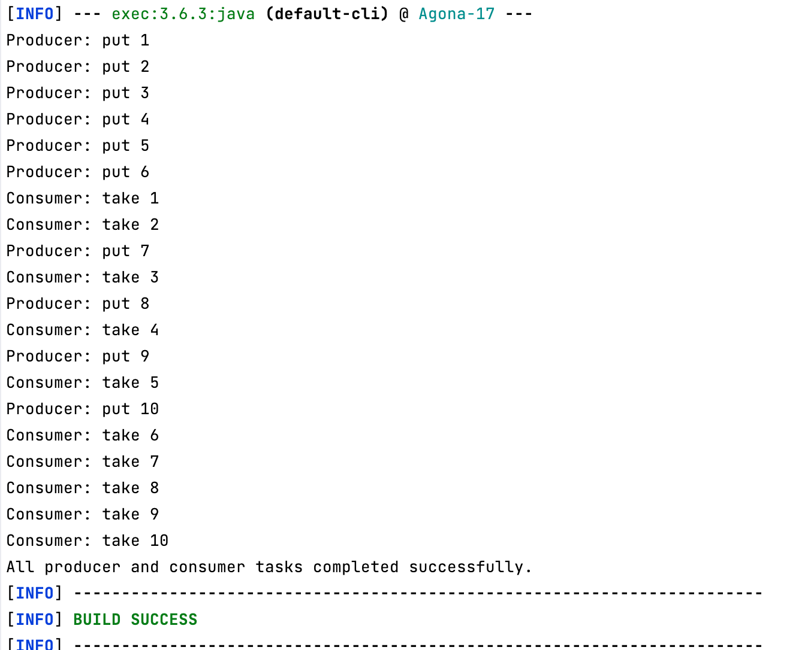

---

## 2. AtomicInteger (CAS)
- Показано, что counter++ не является атомарной операцией (read-modify-write)
- Используется AtomicInteger как lock-free механизм синхронизации
- Обновления выполняются через CAS (Compare-And-Swap)
- Гарантируется корректный результат при конкурентных инкрементах без synchronized и Lock

---

## Консольный вывод:
Демонстрация достижения точного целевого значения (2000) при конкурентных инкрементах благодаря атомарным операциям CAS.

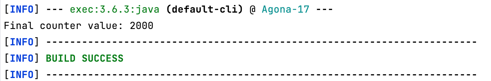

---

## 3. ExecutorService + Callable + Future
- Используется Callable для задач, возвращающих результат
- Асинхронное выполнение через ExecutorService с виртуальными потоками
- Future представляет результат выполнения задачи и её состояние
- get() - блокирующий вызов, ожидающий завершения вычислений
- Поддержан таймаут ожидания через get(timeout, TimeUnit)
- Обработаны исключения выполнения (ExecutionException, TimeoutException, InterruptedException)

---

## Консольный вывод:
Демонстрация асинхронного выполнения Callable-задач пулом виртуальных потоков и корректной блокировки main-потока до получения результатов.

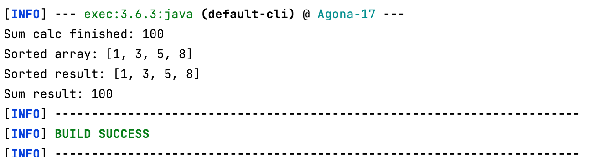

---

## 4. Virtual threads (базовая модель)
- Используется newVirtualThreadPerTaskExecutor для запуска задач в виртуальных потоках
- Массовый параллелизм без создания OS threads (one task = one virtual thread)
- Демонстрация блокирующего поведения (sleep) без затрат на platform thread parking
- Имитация I/O-задачи с прогрессом выполнения (upload simulation)
- Сериализация вывода через ReentrantLock для читаемого логирования при высокой конкуренции

---

## Консольный вывод:

Демонстрация симуляции параллельной загрузки группы независимых файлов.

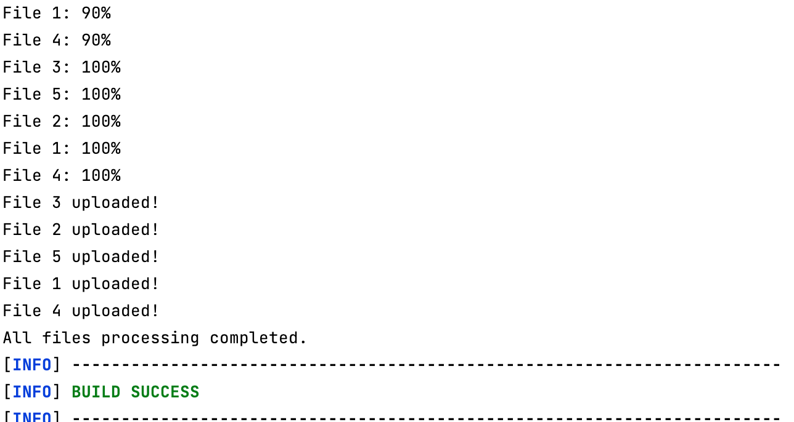

---

## 5. HTTP Server (virtual thread per request)
- Каждый HTTP-запрос обрабатывается в отдельном виртуальном потоке (Thread.startVirtualThread)
- Модель request-per-thread без затрат на platform thread на каждый запрос
- Масштабируемая обработка большого числа concurrent HTTP соединений
- Корректное освобождение ресурсов через exchange.close() и try-with-resources для response body
- Сериализация логов через ReentrantLock для читаемого вывода при параллельной обработке запросов

## Консольный вывод:

Демонстрация успешных ответов сервера при симуляции входящих HTTP-запросов на порт 8080.

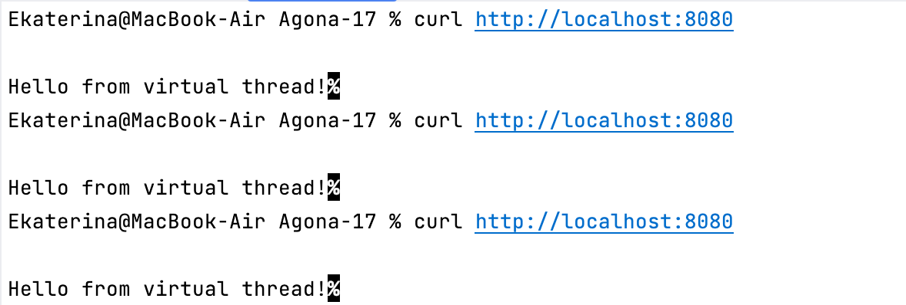
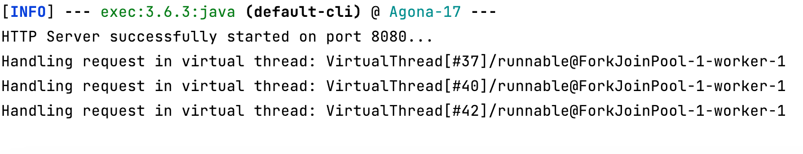

---

## 6. Account + ReentrantLock (synchronization and deadlock avoidance)
- Модель банковского аккаунта с потокобезопасным доступом через ReentrantLock
- Защита критической секции операций deposit, withdraw, getBalance
- Реализован transfer между аккаунтами с потенциальным deadlock сценарием
- Избежание deadlock через tryLock(timeout) и повторные попытки захвата обоих locks
- Используется backoff (Thread.sleep) для предотвращения активного ожидания
- Гарантируется консистентность баланса при конкурентных переводах

---

## Консольный вывод:

Демонстрация успешного выполнения встречных переводов и предотвращения Deadlock благодаря неблокирующему захвату ресурсов через tryLock() с таймаутом.

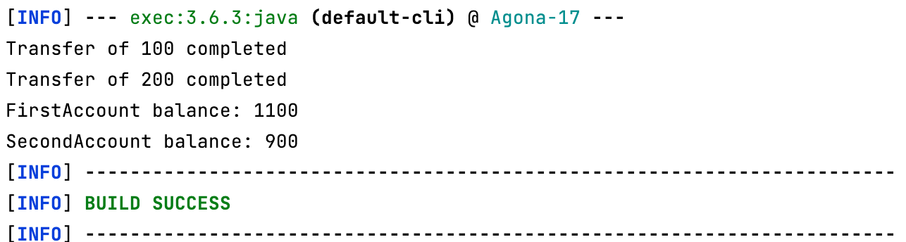

---

## 7. ScheduledExecutorService (task scheduling)
- Используется ScheduledExecutorService для периодического выполнения задач
- Модель scheduleWithFixedDelay: следующий запуск происходит после завершения предыдущего
- Демонстрация отличия delay-based scheduling
- Обработка исключений внутри задачи для предотвращения остановки периодического execution
- Показано влияние необработанных ошибок на жизненный цикл scheduled tasks
- Корректное завершение через shutdown() с отложенной остановкой

---

## Консольный вывод:

Демонстрация циклического выполнения задачи с фиксированной задержкой в 3 секунды и штатная остановка планировщика через shutdown().

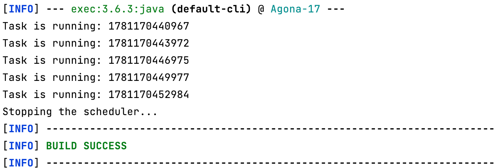

---

## 8. Semaphore (resource limiting)
- Используется Semaphore для ограничения количества одновременно выполняемых операций
- Модель ограниченного ресурса (parking spots = 3)
- acquire()/release() управляют доступом к критической секции
- Демонстрация blocking поведения при отсутствии доступных permits
- Используется fairness mode (fair = true) для FIFO распределения доступа
- Гарантированное освобождение ресурса через finally блок

---

## Консольный вывод:

Демонстрация ограничения одновременного доступа к пулу ресурсов через Semaphore(3) и продвижения потоков в порядке FIFO.

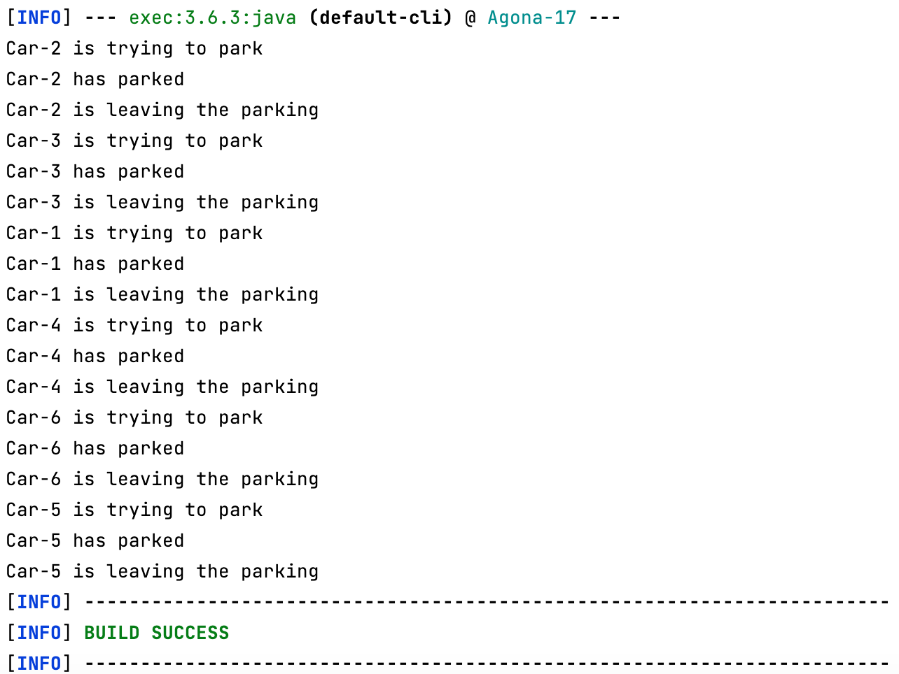

---

## 9. VirtualThreadTask (scalability demonstration)
- Запуск большого количества виртуальных потоков (10_000 concurrent tasks)
- Демонстрация масштабируемости виртуальных потоков по сравнению с платформенными
- Блокирующая операция (Thread.sleep) не приводит к блокировке OS thread
- Показано поведение виртуальных потоков при массовом параллельном запуске
- Синхронизация вывода через ReentrantLock для читаемого логирования результатов

---

## Консольный вывод:

Демонстрация успешного параллельного выполнения 10 000 изолированных задач в пуле виртуальных потоков без перегрузки памяти.

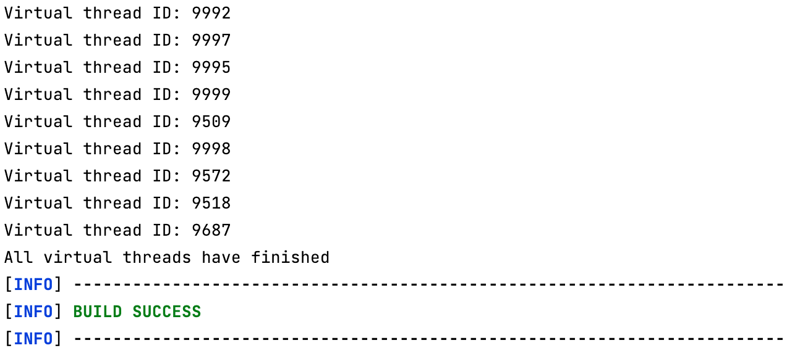

---

## 10. CountDownLatch (one-time thread coordination)

- Используется для ожидания завершения группы параллельных задач
- Основной поток блокируется через await() до получения сигнала от всех worker-потоков
- Каждый поток уменьшает внутренний счётчик через countDown() после завершения работы
- Демонстрируется модель "дождаться всех участников перед продолжением выполнения"
- CountDownLatch является одноразовым механизмом синхронизации и не может быть переиспользован после достижения нулевого значения

---

## Консольный вывод:
Демонстрация блокировки главного потока через await() до момента, пока все три воркера не вызовут countDown().

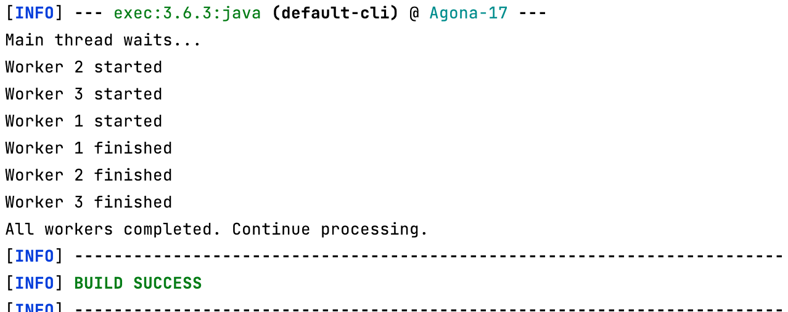

---

## 11. CyclicBarrier (phase synchronization)

- Используется для синхронизации группы потоков на общей точке выполнения
- Каждый поток выполняет первую фазу работы независимо и вызывает await()
- Выполнение второй фазы начинается только после достижения барьера всеми участниками
- Демонстрируется модель поэтапного выполнения (phase-based execution)
- Поддерживается barrier action - дополнительная задача, выполняемая при достижении барьера всеми потоками
- В отличие от CountDownLatch, CyclicBarrier может использоваться повторно после завершения очередного цикла синхронизации

---

## Консольный вывод:
Демонстрация блокировки потоков на точке barrier.await() и автоматический переход к следующей фазе после сбора 3 участников.

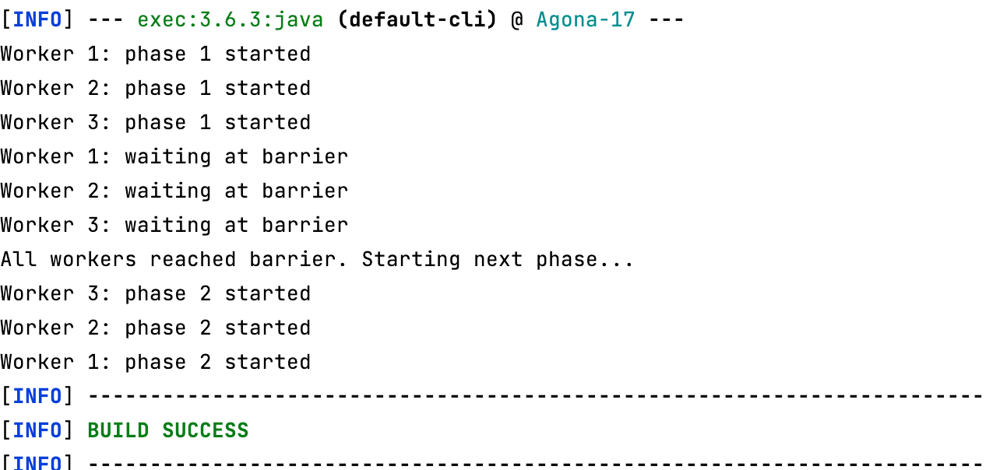

---

## 12. ReadWriteLock (read-heavy synchronization)

- Используется для разделения операций чтения и записи
- Несколько потоков могут одновременно выполнять чтение данных через ReadLock
- Операция записи через WriteLock выполняется эксклюзивно и блокирует доступ остальных потоков
- Демонстрируется сценарий с преобладанием чтения над записью (read-heavy workload)
- Позволяет повысить параллелизм по сравнению с обычным ReentrantLock
- Подходит для кэшей, конфигураций и справочных данных с редкими обновлениями

---

## Консольный вывод:

Демонстрация изоляции операции записи между параллельными батчами потоков чтения и корректного переключения конфигурации с v1 на v2.

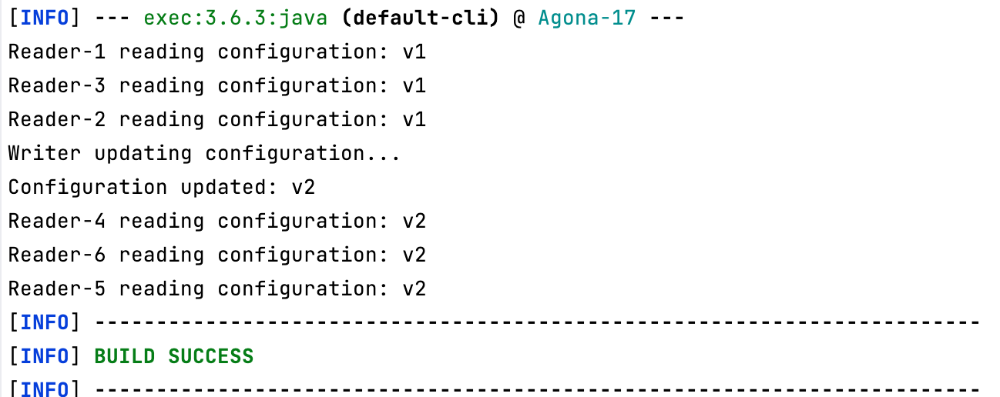

---

## Итог

Репозиторий демонстрирует базовые и прикладные механизмы конкурентности в Java через набор изолированных кейсов:

- модели синхронизации (ReentrantLock, ReadWriteLock, Semaphore)
- lock-free подход (CAS через AtomicInteger)
- координация потоков (BlockingQueue, CountDownLatch, CyclicBarrier)
- управление задачами и результатами выполнения (ExecutorService, Callable, Future)
- планирование задач (ScheduledExecutorService)
- обработка I/O и request-per-thread модель
- виртуальные потоки и их масштабирование

Проекты иллюстрируют ключевые свойства конкурентных систем: blocking behavior, race conditions, thread coordination, deadlock avoidance, task scheduling semantics и scalability при высокой конкуренции.
